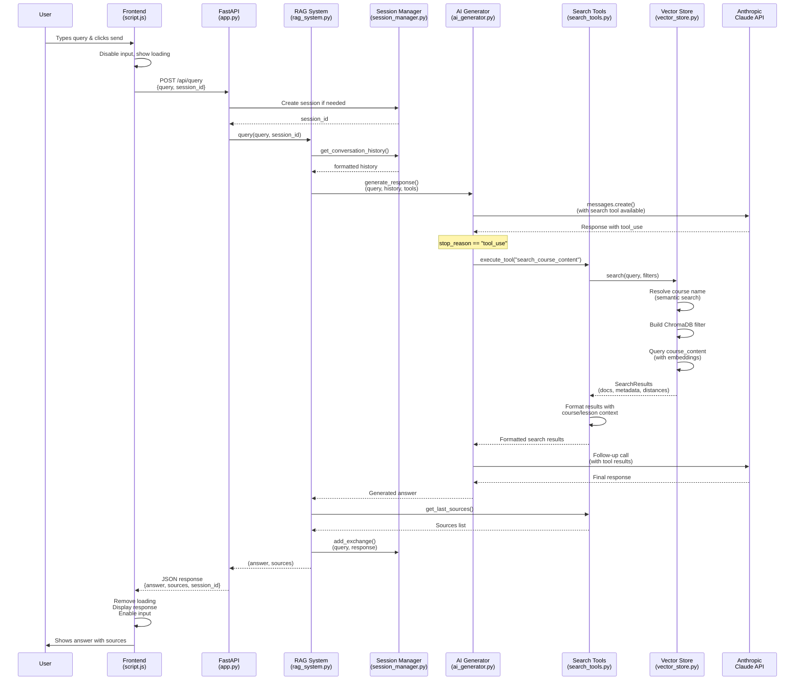
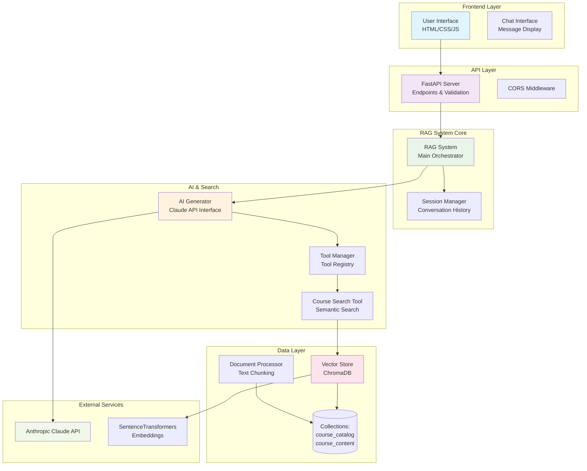
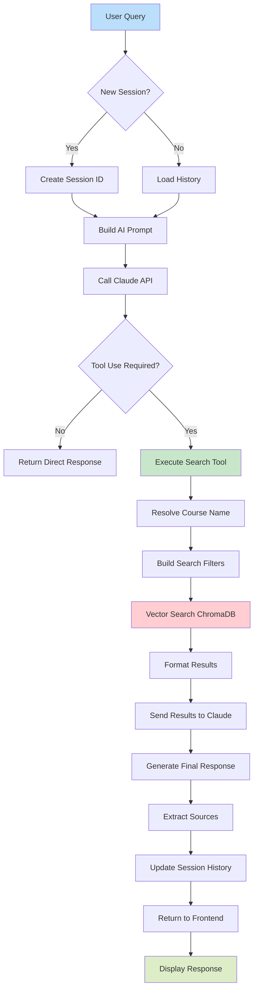

# RAG Chatbot Query Processing Flow

```mermaid
sequenceDiagram
    participant User
    participant Frontend as Frontend<br/>(script.js)
    participant API as FastAPI<br/>(app.py)
    participant RAG as RAG System<br/>(rag_system.py)
    participant Session as Session Manager<br/>(session_manager.py)
    participant AI as AI Generator<br/>(ai_generator.py)
    participant Tools as Search Tools<br/>(search_tools.py)
    participant Vector as Vector Store<br/>(vector_store.py)
    participant Claude as Anthropic<br/>Claude API

    User->>Frontend: Types query & clicks send
    Frontend->>Frontend: Disable input, show loading
    
    Frontend->>API: POST /api/query<br/>{query, session_id}
    
    API->>Session: Create session if needed
    Session-->>API: session_id
    
    API->>RAG: query(query, session_id)
    
    RAG->>Session: get_conversation_history()
    Session-->>RAG: formatted history
    
    RAG->>AI: generate_response()<br/>(query, history, tools)
    
    AI->>Claude: messages.create()<br/>(with search tool available)
    Claude-->>AI: Response with tool_use
    
    Note over AI: stop_reason == "tool_use"
    
    AI->>Tools: execute_tool("search_course_content")
    Tools->>Vector: search(query, filters)
    
    Vector->>Vector: Resolve course name<br/>(semantic search)
    Vector->>Vector: Build ChromaDB filter
    Vector->>Vector: Query course_content<br/>(with embeddings)
    Vector-->>Tools: SearchResults<br/>(docs, metadata, distances)
    
    Tools->>Tools: Format results with<br/>course/lesson context
    Tools-->>AI: Formatted search results
    
    AI->>Claude: Follow-up call<br/>(with tool results)
    Claude-->>AI: Final response
    
    AI-->>RAG: Generated answer
    
    RAG->>Tools: get_last_sources()
    Tools-->>RAG: Sources list
    
    RAG->>Session: add_exchange()<br/>(query, response)
    
    RAG-->>API: (answer, sources)
    
    API-->>Frontend: JSON response<br/>{answer, sources, session_id}
    
    Frontend->>Frontend: Remove loading<br/>Display response<br/>Enable input
    Frontend->>User: Shows answer with sources
```

## Component Architecture

```mermaid
graph TB
    subgraph "Frontend Layer"
        UI[User Interface<br/>HTML/CSS/JS]
        Chat[Chat Interface<br/>Message Display]
    end
    
    subgraph "API Layer"
        FastAPI[FastAPI Server<br/>Endpoints & Validation]
        CORS[CORS Middleware]
    end
    
    subgraph "RAG System Core"
        Orchestrator[RAG System<br/>Main Orchestrator]
        Session[Session Manager<br/>Conversation History]
    end
    
    subgraph "AI & Search"
        Generator[AI Generator<br/>Claude API Interface]
        ToolMgr[Tool Manager<br/>Tool Registry]
        SearchTool[Course Search Tool<br/>Semantic Search]
    end
    
    subgraph "Data Layer"
        Vector[Vector Store<br/>ChromaDB]
        Processor[Document Processor<br/>Text Chunking]
        Collections[(Collections:<br/>course_catalog<br/>course_content)]
    end
    
    subgraph "External Services"
        Claude[Anthropic Claude API]
        Embeddings[SentenceTransformers<br/>Embeddings]
    end
    
    UI --> FastAPI
    FastAPI --> Orchestrator
    Orchestrator --> Session
    Orchestrator --> Generator
    Generator --> Claude
    Generator --> ToolMgr
    ToolMgr --> SearchTool
    SearchTool --> Vector
    Vector --> Collections
    Vector --> Embeddings
    Processor --> Collections
    
    style UI fill:#e1f5fe
    style FastAPI fill:#f3e5f5
    style Orchestrator fill:#e8f5e8
    style Generator fill:#fff3e0
    style Vector fill:#fce4ec
    style Claude fill:#f1f8e9
```

## Data Flow Detail

```mermaid
flowchart TD
    A[User Query] --> B{New Session?}
    B -->|Yes| C[Create Session ID]
    B -->|No| D[Load History]
    C --> E[Build AI Prompt]
    D --> E
    E --> F[Call Claude API]
    F --> G{Tool Use Required?}
    G -->|No| H[Return Direct Response]
    G -->|Yes| I[Execute Search Tool]
    I --> J[Resolve Course Name]
    J --> K[Build Search Filters]
    K --> L[Vector Search ChromaDB]
    L --> M[Format Results]
    M --> N[Send Results to Claude]
    N --> O[Generate Final Response]
    O --> P[Extract Sources]
    P --> Q[Update Session History]
    Q --> R[Return to Frontend]
    R --> S[Display Response]
    
    style A fill:#bbdefb
    style I fill:#c8e6c9
    style L fill:#ffcdd2
    style S fill:#dcedc8
```